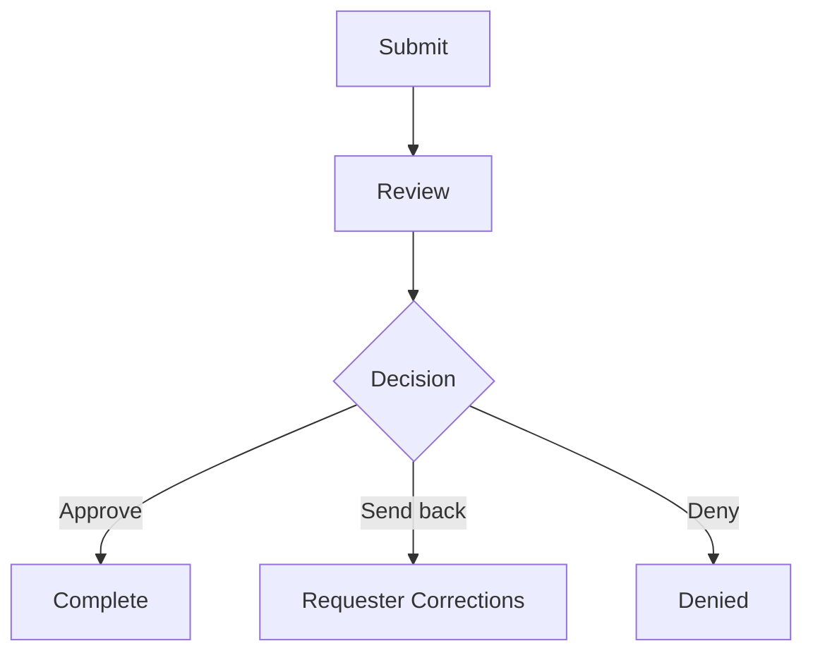

# CSUB Kuali App Blueprint

Use this template for new Kuali apps or meaningful improvements to an existing app.

Token rule: default to a compact blueprint. Fill only sections that matter for the request. Omit empty sections, blank rows, and low-value tables unless the user asks for a full implementation blueprint.

## App Summary

- Proposed app name:
- Existing app name/id, if any:
- Environment:
- Owning office:
- Business process:
- Primary outcome:

## Sources Reviewed

- Kuali app(s):
- Reference app(s):
- CSUB.edu source(s):
- Other source(s):

## Assumptions

- 

## Open Questions

- 

## User Roles

| Role | Who | Responsibility | Kuali Access Needed |
| --- | --- | --- | --- |
| Submitter |  |  |  |
| Reviewer |  |  |  |
| Approver |  |  |  |
| Final record owner |  |  |  |
| Administrator |  |  |  |

## Form Structure

| Section | Purpose | Key Fields | Required Logic | Visibility/Edit Notes |
| --- | --- | --- | --- | --- |
|  |  |  |  |  |

## Field Recommendations

| Field Label | Field Type | Required | Reporting Name | Routing/Email Dependency | Notes |
| --- | --- | --- | --- | --- | --- |
|  |  |  |  |  |  |

## Workflow Map

## Approval Matrix

| Step | Type | Trigger | Assignee | Action | Outcomes | Email | Send-back | Edit/View Rights | Notes |
| --- | --- | --- | --- | --- | --- | --- | --- | --- | --- |
|  |  |  |  |  |  |  |  |  |  |

## Conditional Logic

| Condition | Source Field | Outcome | Notes |
| --- | --- | --- | --- |
|  |  |  |  |

## Notification And Email Plan

| Event | Recipient | Template Name | Purpose | Required Action | Merge Fields | When Not To Send |
| --- | --- | --- | --- | --- | --- | --- |
| Submission | Submitter | Submission Confirmation |  |  |  |  |
| Review task | Reviewer | Review Required |  |  |  |  |
| Send-back | Submitter | Returned For Corrections |  |  |  |  |
| Approval | Submitter/office | Request Approved |  |  |  |  |
| Denial | Submitter | Request Denied |  |  |  |  |
| Completion | Submitter/owner | Request Completed |  |  |  |  |

## Permission Model

| Access | Recommended Role/Group/User | Scope | Notes |
| --- | --- | --- | --- |
| Submit |  |  |  |
| View submitted requests |  |  |  |
| Edit drafts |  |  |  |
| Edit after submission |  |  |  |
| Approve/complete tasks |  |  |  |
| Administer |  |  |  |
| Export/report |  |  |  |

## Integrations, Attachments, And Exports

- Integrations:
- Required attachments:
- Export/reporting needs:
- Failure handling:

## Risks And Manual Review

- 

## Implementation Steps

1. 
2. 
3. 

## Testing Checklist

- Draft creation
- Required fields
- Conditional visibility
- Field validation
- Submit behavior
- Workflow routing
- Approval path
- Send-back path
- Denial path
- Completion path
- Email notifications
- Permission boundaries
- Attachments
- Integrations, if applicable
- Exports/reporting fields
- Mobile or small-screen usability, if relevant
